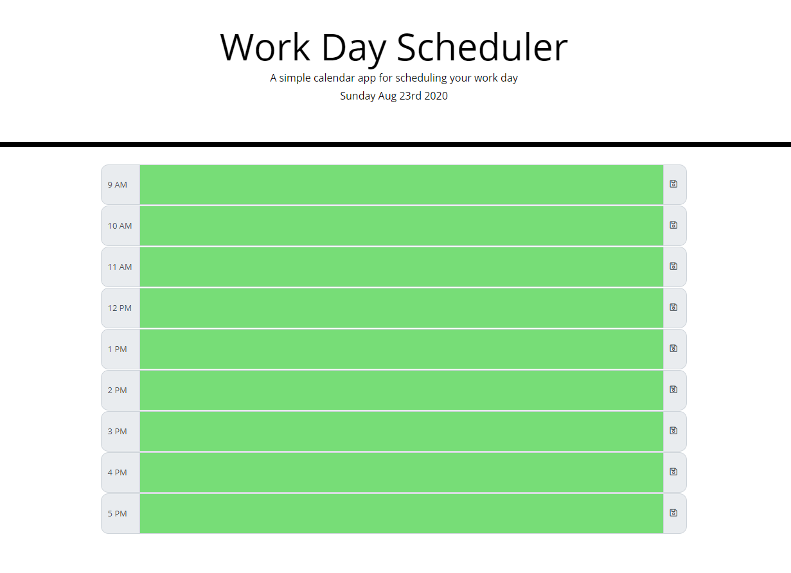

# Diana Shull's Daily Planner

* The daily planner offers time slots between 9am and 5pm
* You can enter in a scheduled item into each of the time slots
* When the page is refreshed the entered infomration is saved and populates where it was entered

# Link to deployed site

* [Daily Planner](https://dianalynshull.github.io/Daily-Planner/)

## Description

* This site allows you to plan out your day by adding scheduled items into each time slot

## Requirements for Project

* GIVEN I am using a daily planner to create a schedule
* WHEN I open the planner
* THEN the current day is displayed at the top of the calendar
* WHEN I scroll down
* THEN I am presented with timeblocks for standard business hours
* WHEN I view the timeblocks for that day
* THEN each timeblock is color coded to indicate whether it is in the past, present, or future
* WHEN I click into a timeblock
* THEN I can enter an event
* WHEN I click the save button for that timeblock
* THEN the text for that event is saved in local storage
* THEN I refresh the page
* THEN the saved events persist

## Acknowledgments

Inspiration, code snippets, etc.

* READ ME INSPIRATION
    * [DomPizzie](https://gist.github.com/DomPizzie/7a5ff55ffa9081f2de27c315f5018afc)

* SITES USED
    * [Bootstrap](https://getbootstrap.com)
    * [Font Awesome](https://fontawesome.com/start)
    * [Moment.js](https://momentjs.com/)

* COLLABORATOR
    * Diego Hernandez